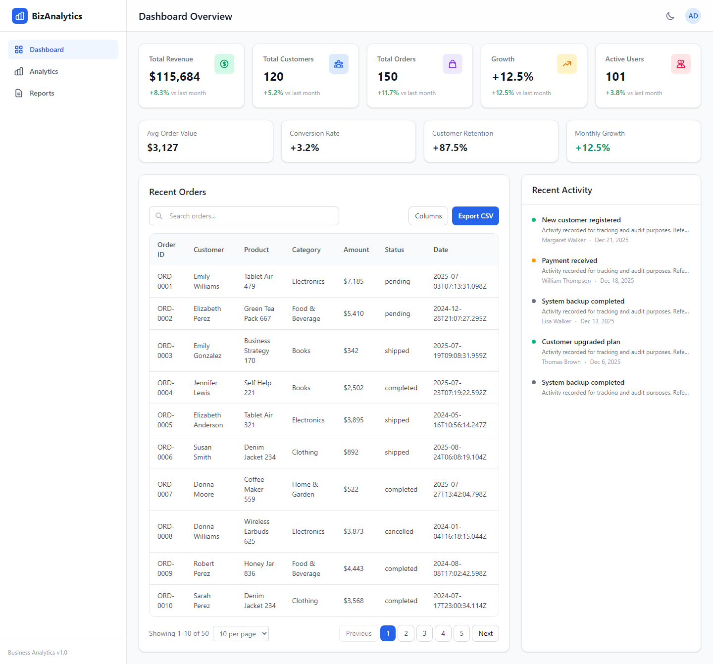
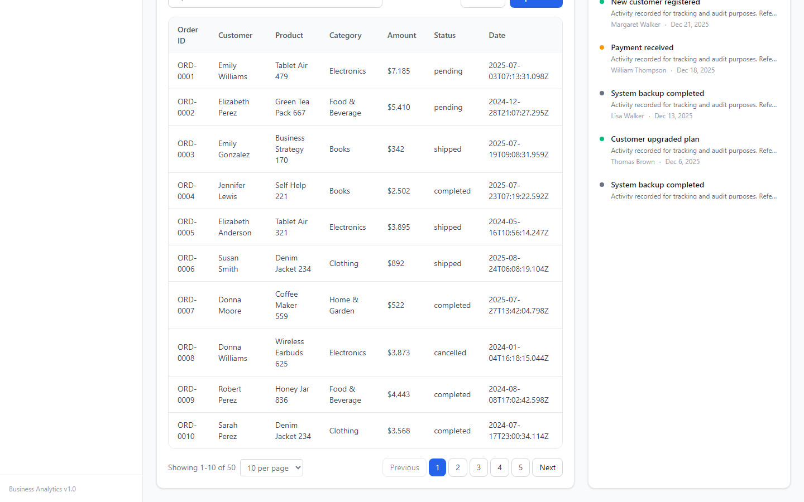
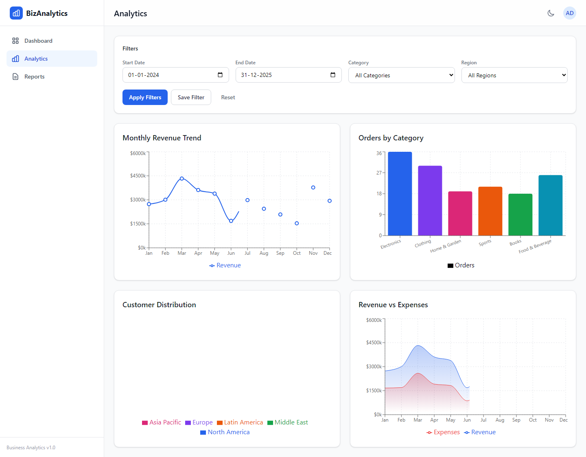
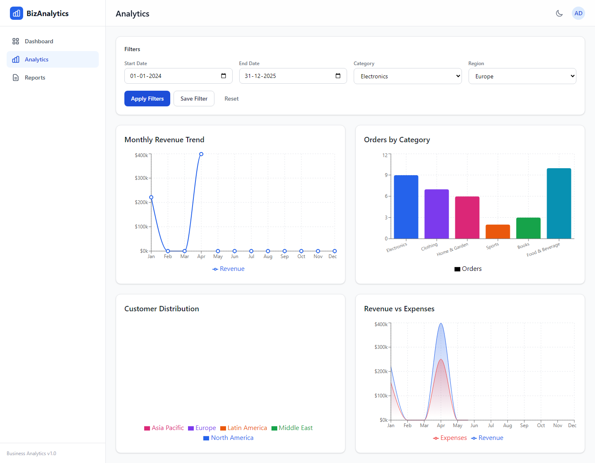
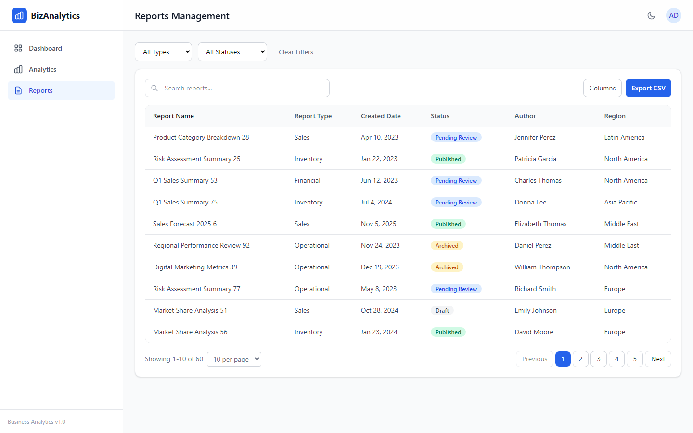
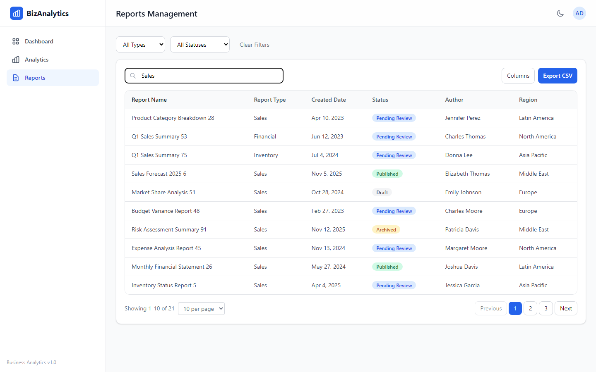
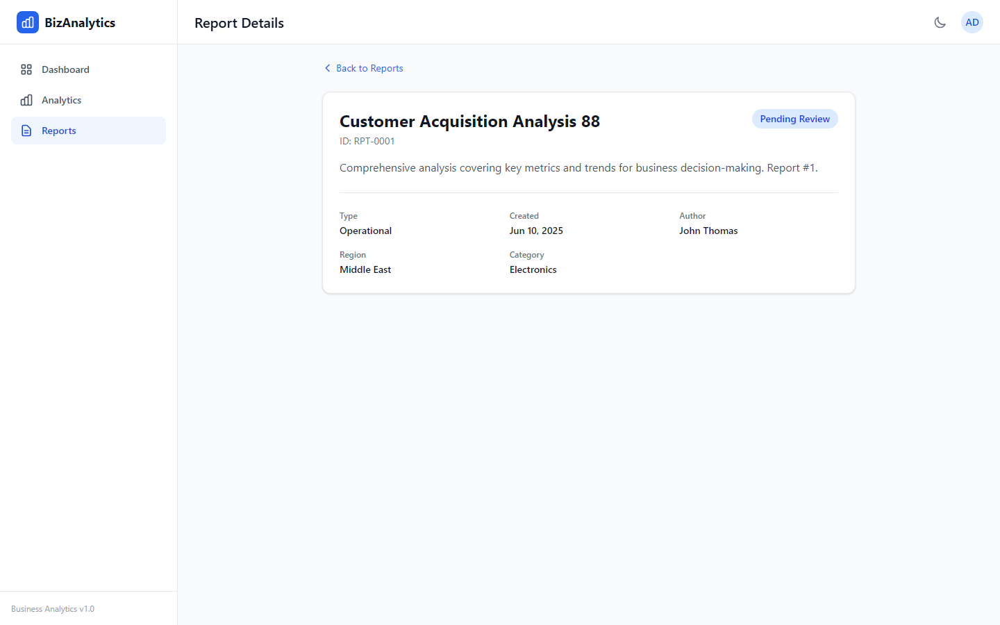
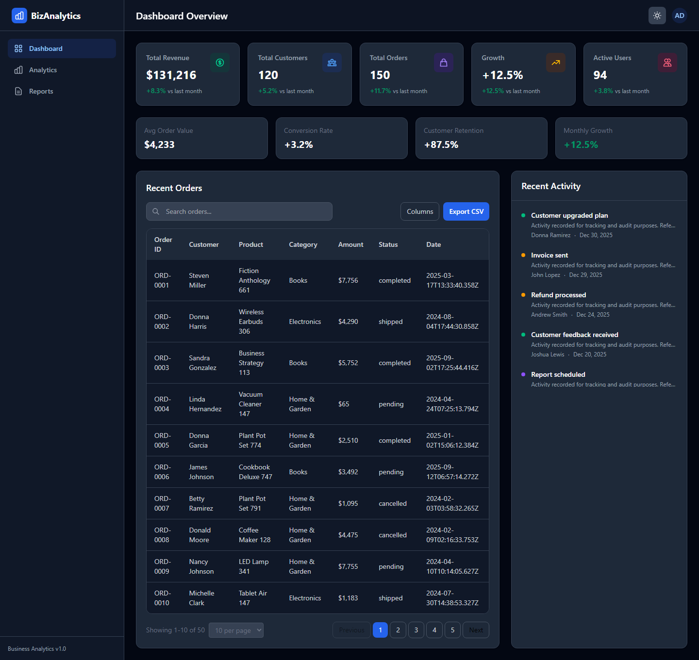
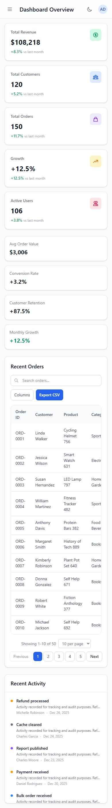
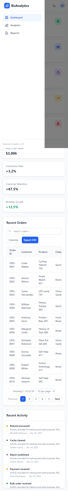

# Business Analytics & Reporting Dashboard

A full-featured Business Analytics and Reporting Dashboard built with React, TypeScript, and Tailwind CSS. Provides operational insights, KPI tracking, interactive data visualization, and comprehensive report management.

## Setup Instructions

### Prerequisites
- Node.js 18+ 
- npm 9+

### Installation

```bash
# Clone the repository
git clone https://github.com/thestacklyvineshj/Business-Analytics-Reporting-Dashboard.git
cd Business-Analytics-Reporting-Dashboard

# Install dependencies
npm install

# Start development server
npm run dev

# Build for production
npm run build

# Preview production build
npm run preview
```

The app runs at `http://localhost:5173` by default.

## Folder Structure

```
src/
├── types/           # TypeScript interfaces and type definitions
├── context/         # Context API + useReducer state management
├── hooks/           # Reusable custom hooks
├── pages/           # Route-level page components (lazy loaded)
├── components/      # Shared UI components
├── charts/          # Recharts visualization components
├── tables/          # Reusable DataTable component
├── utils/           # Helpers, formatters, mock data, CSV export
├── constants/       # App-wide constants and enums
├── assets/          # Static assets
├── App.tsx          # Root component with routing
└── index.tsx        # Application entry point
```

## Features Implemented

### Dashboard Overview
- KPI cards: Total Revenue, Customers, Orders, Growth %, Active Users
- Trend indicators with month-over-month comparison
- Summary statistics (Avg Order Value, Conversion Rate, Retention, Growth)
- Recent Activity panel with real-time-style feed
- Recent Orders table with search, sort, pagination, and CSV export

### Analytics Module
- **Monthly Revenue Trend** — Line chart
- **Orders by Category** — Bar chart
- **Customer Distribution** — Pie chart
- **Revenue vs Expenses** — Area chart
- Filters: Date range, Category, Region (React Hook Form + Zod validation)
- Saved filters support

### Reports Management
- Report listing with Name, Type, Created Date, Status
- Search, filter (type/status), sort, pagination
- Click-through to report detail view
- CSV export

### Reusable Data Table
- Sorting, filtering, search, pagination
- Column visibility toggle
- CSV export
- Used on Dashboard and Reports pages

### Custom Hooks
| Hook | Purpose |
|------|---------|
| `useDataFetching` | Simulated API/data fetching with loading & error states |
| `useSearch` | Debounced search logic across configurable keys |
| `usePagination` | Page navigation, page size control |
| `useFilter` | Multi-field and date range filtering |
| `useCsvExport` | CSV file generation and download |

### Error Handling
- `ErrorBoundary` component wrapping the entire app
- Loading spinners and skeleton components
- Empty state components with actionable CTAs
- User-friendly error messages on data fetch failures

### Good-to-Have Features
- **Theme Switcher** — Light/dark mode toggle
- **Saved Filters** — Persist analytics filter presets
- **Skeleton Loading** — Dashboard and table skeleton placeholders

## Optimization Techniques Used

| Technique | Where | Why |
|-----------|-------|-----|
| `React.memo` | KPICard, charts, Sidebar, Header, DataTable, etc. | Prevents unnecessary re-renders of pure presentational components |
| `useMemo` | AppContext value, sorted/filtered data, chart data | Avoids recalculating derived data on every render |
| `useCallback` | Event handlers in Layout, FilterPanel, DataTable | Stable function references for memoized children |
| `React.lazy` | Dashboard, Analytics, Reports, ReportDetail pages | Code splitting — loads pages on demand |
| `Suspense` | Route-level fallbacks in App.tsx | Graceful loading UI during lazy chunk fetch |

## Mock Data

All data is generated programmatically with 100+ records per dataset:

| Dataset | Records |
|---------|---------|
| Customers | 120 |
| Products | 120 |
| Orders | 150 |
| Revenue Records | 120 |
| Reports | 60 |
| Activities | 100 |

## Assumptions Made

1. **No backend** — All data is mock/simulated with artificial loading delays to demonstrate async patterns.
2. **Currency** — All monetary values are in USD.
3. **Date range filtering** — Applied at the analytics chart level via region/category; full date-range slicing on raw records is simplified for demo purposes.
4. **Authentication** — Not implemented; the app assumes an authenticated admin user.
5. **PDF export** — Not implemented (listed as good-to-have); CSV export is fully functional.
6. **Chart drill-down** — Not implemented; charts are read-only visualizations.

## Tech Stack

- React 19 + TypeScript
- Tailwind CSS 4
- React Router DOM 7
- Context API + useReducer
- Recharts 3
- React Hook Form + Zod
- Vite 8

## Screenshots

### Dashboard Overview


KPI cards, summary statistics, recent orders table, and activity panel.



### Analytics Module


Four interactive charts: Monthly Revenue Trend, Orders by Category, Customer Distribution, and Revenue vs Expenses.



Analytics with category and region filters applied.

### Reports Management


Full reports table with type/status filters, search, sort, and pagination.



Search results filtered by keyword.



Individual report detail view with metadata.

### Theme & Responsive Design


Dark theme across the dashboard.



Responsive layout on mobile viewport.



Mobile navigation sidebar.

## License

MIT
